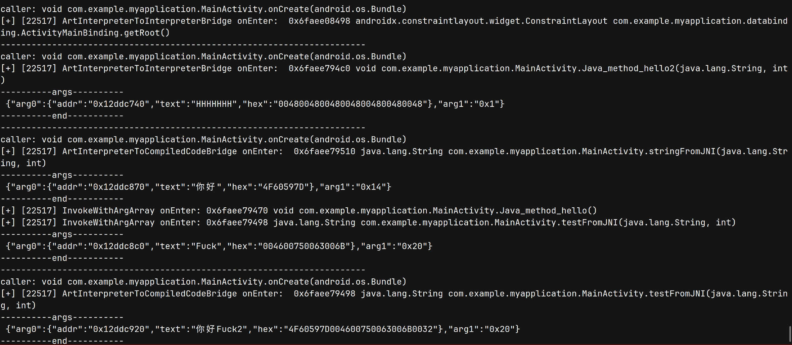

## 1. 简介

基于Android10的API，通过Frida对Arm64位的libart.so进行hook,追宗`Java->Java`, `Java->JNI`, `JNI->Java`, `JNI->JNI`。

假设存在以下调用代码：

```java
// MainActivity.java
package com.example.myapplication;

import androidx.appcompat.app.AppCompatActivity;

import android.os.Bundle;
import android.util.Log;
import android.widget.TextView;

import com.example.myapplication.databinding.ActivityMainBinding;

import java.lang.reflect.InvocationTargetException;
import java.lang.reflect.Method;

public class MainActivity extends AppCompatActivity {

    static {
        System.loadLibrary("myapplication");
    }

    private ActivityMainBinding binding;

    @Override
    protected void onCreate(Bundle savedInstanceState) {
        super.onCreate(savedInstanceState);

        binding = ActivityMainBinding.inflate(getLayoutInflater());
        setContentView(binding.getRoot());

        int[] int_arr = {48};
        Java_method_hello2("HHHHHHH", 1);
        TextView tv = binding.sampleText;
        tv.setText(stringFromJNI("你好", 20));

        tv.setText(testFromJNI("你好Fuck2", 32));

    }
    public static void Java_method_hello() {
        Log.i("myapplication2", "Java_method_hello: " + "Hello World!!!");
    }
    public void Java_method_hello2(String H, int a) {
        Log.i("myapplication2", "Java_method_hello2: " + H);
    }
    public native String stringFromJNI(String str, int a);
    public static native String testFromJNI(String text, int num);
}
```


```c++
// native-lib.cpp
#include <jni.h>
#include <string>

// can't trace
std::unique_ptr<std::string> normal_func() {
    std::unique_ptr<std::string>hello(new std::string("Hello from normal_func."));
    return hello;

}
extern "C" JNIEXPORT jstring JNICALL
Java_com_example_myapplication_MainActivity_stringFromJNI(
        JNIEnv* env,
        jobject /* this */,
        jstring str,
        jint a) {
    std::string hello = "Hello from C++";
    auto m = normal_func();
    jclass mainActivityClass = env->FindClass("com/example/myapplication/MainActivity");
    jmethodID methodId = env->GetStaticMethodID(mainActivityClass, "Java_method_hello", "()V");
    env->CallStaticVoidMethod(mainActivityClass, methodId);
    jmethodID methodId2 = env->GetStaticMethodID(mainActivityClass, "testFromJNI", "(Ljava/lang/String;I)Ljava/lang/String;");
    jstring jstr = env->NewStringUTF("Fuck");
    env->CallStaticObjectMethod(mainActivityClass, methodId2, jstr, 32);
    if(mainActivityClass) {
        env->DeleteLocalRef(mainActivityClass);
        env->DeleteLocalRef(jstr);
    }
    return env->NewStringUTF(hello.c_str());
}

extern "C" JNIEXPORT jstring JNICALL
Java_com_example_myapplication_MainActivity_testFromJNI(
        JNIEnv* env,
        jclass,
        jstring text,
        jint num) {
    std::string hello = "Hello from C++";
    hello += std::string(env->GetStringUTFChars(text, nullptr) + std::to_string(num));
    return env->NewStringUTF(hello.c_str());
}
```


追宗结果：



## 2. 使用方法

1. 基于Android10 + Arm64位的app

2. 确保[`use_fast_path = false`](https://xrefandroid.com/android-10.0.0_r47/xref/art/runtime/interpreter/interpreter_common.h#232)

3. 修改entry.ts文件中的包名过滤器：

   ```ts
   function main() {
       const filter = "com.example";   // modify it
       // hook_ArtMethod_Invoke(filter);
       
       hook_ArtInterpreterToInterpreterBridge(filter);
       hook_ArtInterpreterToCompiledCodeBridge(filter);
       hook_InvokeWithArgArray(filter);
   }
   ```

4. `frida -U -l index.js -f com.example.myapplication`

## 3. 原理

1. [追踪Android方法调用1](https://xz.aliyun.com/news/18128)
2. [追踪Android方法调用2](https://xz.aliyun.com/news/18130)
